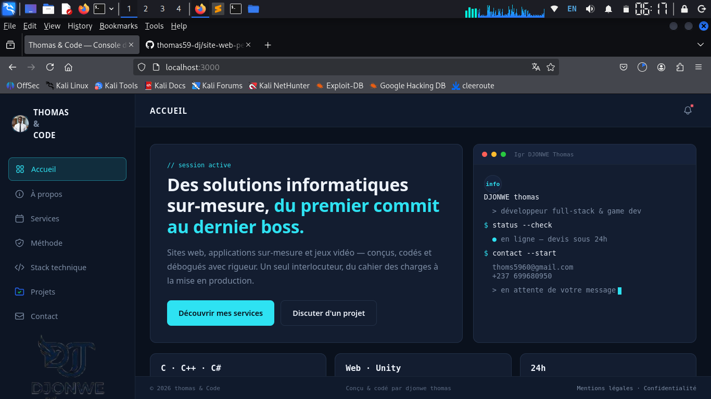
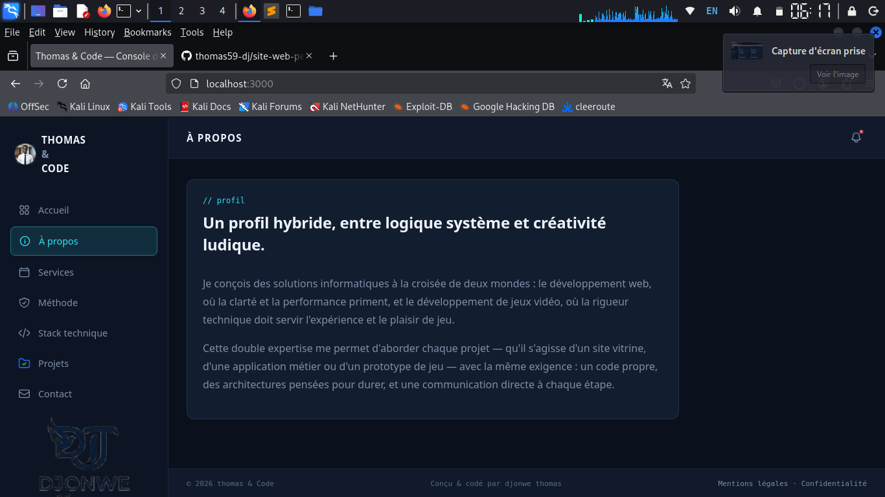
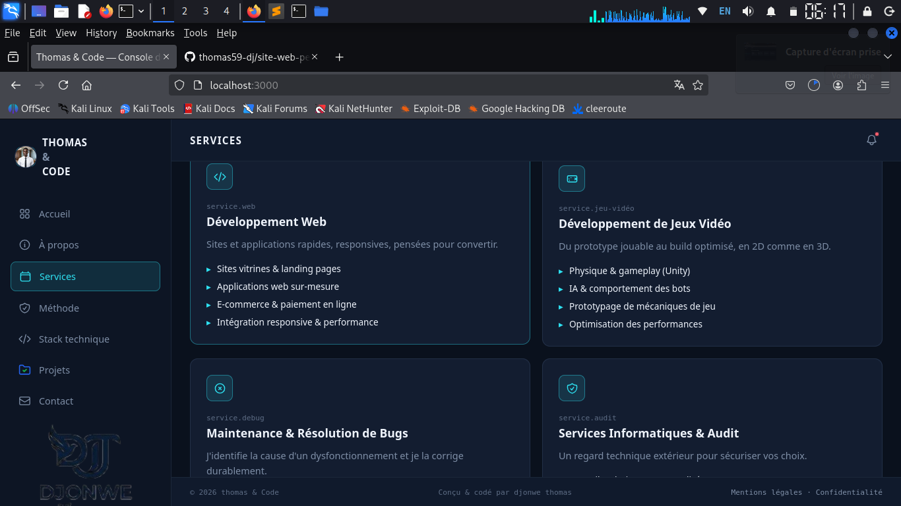
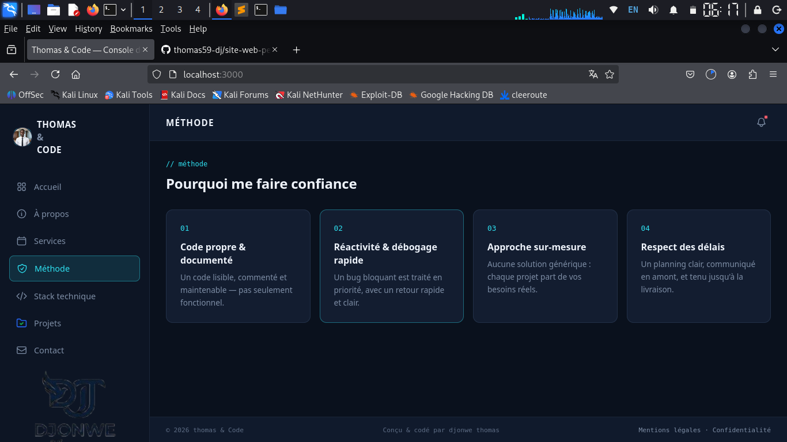

# Pixel & Code — Site vitrine + backend

## 📋 Présentation
- Objectif du site :
- Public visé :
- Aperçu du style : interface dashboard sombre, accent cyan, navigation par sidebar

## 🗂️ Structure du projet
```
mon-projet/
├── index.html
├── css/style.css
├── js/main.js
├── backend/
│   ├── server.js
│   ├── package.json
│   ├── .env (à créer, non versionné)
│   └── data/submissions.json
└── README.md
```

## ✨ Fonctionnalités

### Front-end
- Navigation type "app" (sidebar + pages sans rechargement)
- Formulaire de contact avec validation côté client
- Animations au scroll / responsive mobile

### Backend
- API REST `/api/contact`
- Validation des champs côté serveur
- Envoi d'email via SMTP (optionnel)
- Sauvegarde locale des demandes (JSON)
- Rate limiting anti-spam
- Route de santé `/api/health`

## 🚀 Installation
1. Cloner / télécharger le projet
2. `cd backend && npm install`
3. `cp .env.example .env`
4. Remplir les variables d'environnement (voir ci-dessous)
5. `npm start`
6. Ouvrir http://localhost:3000

## ⚙️ Variables d'environnement (.env)

| Variable | Description | Exemple |
|---|---|---|
| PORT | Port du serveur | 3000 |
| SMTP_HOST | Serveur SMTP | smtp.gmail.com |
| SMTP_PORT | Port SMTP | 587 |
| SMTP_SECURE | Connexion sécurisée (true pour le port 465) | false |
| SMTP_USER | Adresse d'envoi | tonadresse@gmail.com |
| SMTP_PASS | Mot de passe d'application | xxxx xxxx xxxx xxxx |
| CONTACT_TO_EMAIL | Adresse de réception | contact@tonsite.com |

## 🔌 API

### POST /api/contact
Champs attendus dans le corps JSON :
- `name` (obligatoire, 2 à 100 caractères)
- `email` (obligatoire, format valide)
- `project-type` (obligatoire : `web`, `jeu`, `debug`, `audit`, `autre`)
- `message` (obligatoire, 10 à 4000 caractères)
- `detail-level` (optionnel, nombre)

Réponses possibles :
- `200` — demande reçue et traitée
- `400` — erreur de validation (détail dans `error`)
- `429` — trop de tentatives (rate limiting)

### GET /api/health
Vérifie que le serveur tourne et si le SMTP est configuré.

## 🔒 Sécurité
- Helmet (en-têtes HTTP de sécurité)
- Rate limiting : 5 requêtes / 15 minutes / IP sur `/api/contact`
- Validation stricte des champs côté serveur
- `.env` exclu du dépôt Git (`.gitignore`)

## 🌍 Déploiement
- Plateforme utilisée :
- Variables d'environnement à définir en production :
- Points d'attention : monter `backend/data/` sur un volume persistant si la sauvegarde locale est utilisée

## resultat





## 📄 Licence / Auteur
- Auteur :
- Licence :
